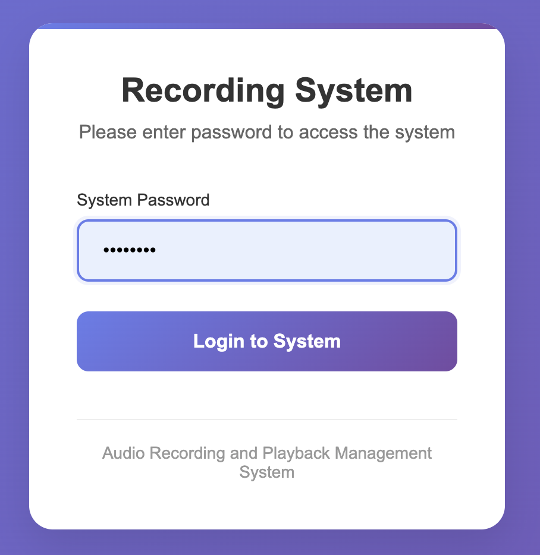
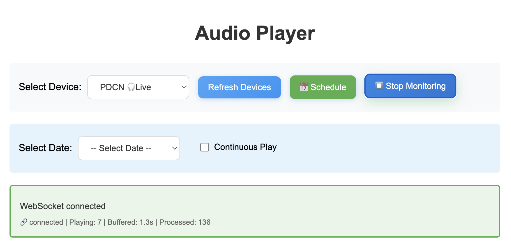
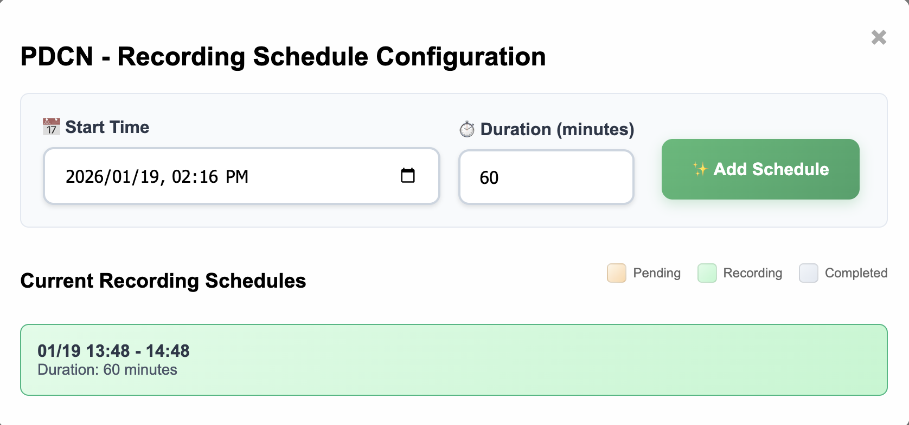
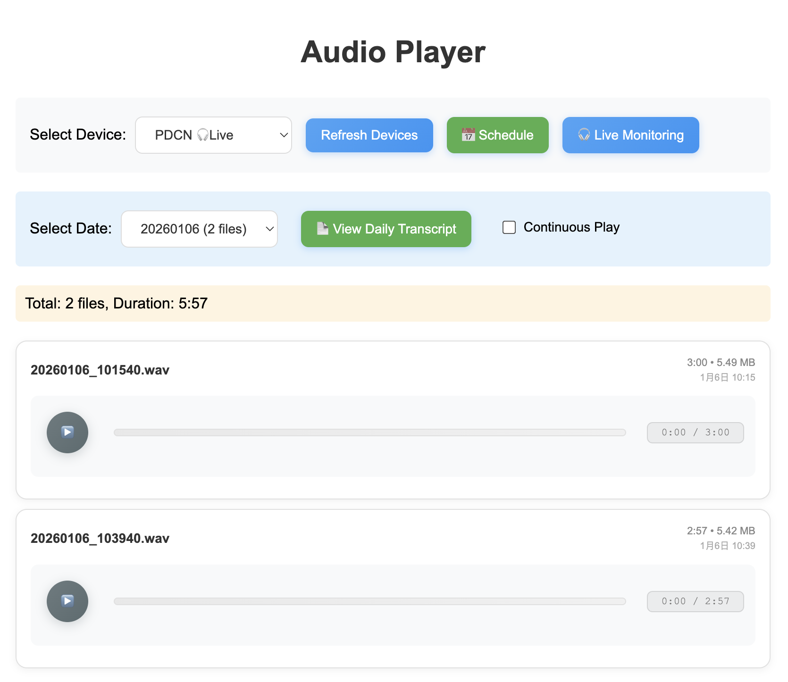
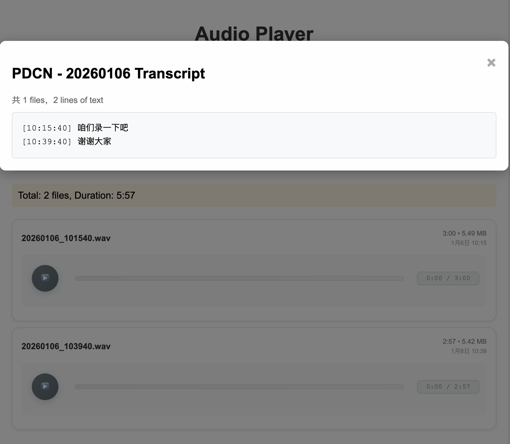

# whisper recorder
recorder whisper real-time monitor timer with mutil esp32-ics43434 arduino
# Server Install
```
pip install torch torchvision torchaudio --index-url https://download.pytorch.org/whl/cu118
pip install faster-whisper fastapi uvicorn[standard] soundfile python-multipart
```
# Pages
## Login

## Real-time Monitoring

## Schedule

## History

## Transcribe   


# Thanks
If you find this project helpful, please give it a star!